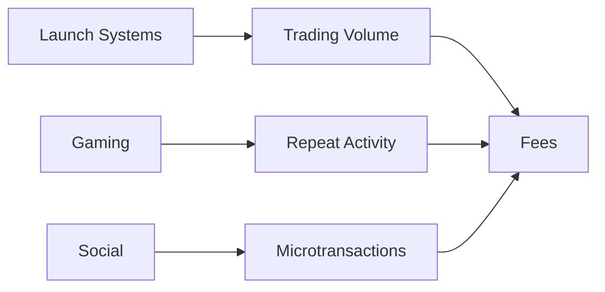

# Activity Overview

The system’s growth is driven by throughput.

The Engine captures value from activity. The Activity Layer determines where that activity originates.

MAX is positioned as the base asset across multiple environments. It functions as a unit of pricing, settlement, and exchange.

This ensures that activity is denominated in MAX and routed through the system’s fee mechanism.

Different environments produce different transaction profiles. Trading systems generate concentrated, high-frequency volume. Gaming environments produce repeatable interaction cycles. Social systems generate continuous microtransaction flow.

Across all environments, the relationship is consistent.

Activity increases. Fee capture increases. The treasury expands. System capacity increases.

The Activity Layer is the system’s source of throughput.

# Activity Overview

The system’s growth is driven by throughput.

The Engine captures value from activity. The Activity Layer determines where that activity originates.

MAX is positioned as the base asset across multiple environments. It functions as a unit of pricing, settlement, and exchange.

This ensures that activity is denominated in MAX and routed through the system’s fee mechanism.

Different environments produce different transaction profiles. Trading systems generate concentrated, high-frequency volume. Gaming environments produce repeatable interaction cycles. Social systems generate continuous microtransaction flow.

Across all environments, the relationship is consistent.

Activity increases. Fee capture increases. The treasury expands. System capacity increases.

The Activity Layer is the system’s source of throughput.
