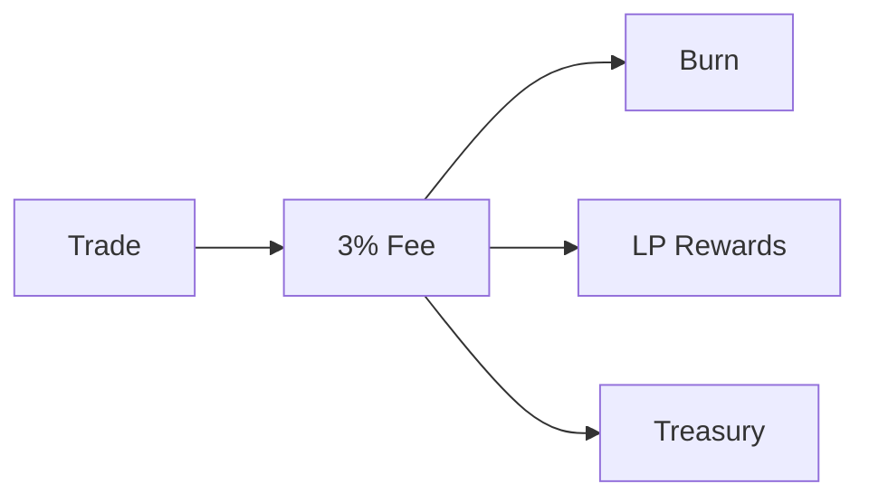

# The Engine

The Engine is the system’s core conversion layer. It transforms transaction activity into retained value.

Every buy and sell transaction executed through liquidity pools incurs a 3% fee applied at the contract level. This fee is structurally embedded and triggered during interactions with recognized liquidity pairs.

The fee is deterministically allocated across three functions.

A portion is permanently removed from circulation through burning. A portion is distributed to liquidity providers. A portion is routed to the treasury.

Each component feeds directly into the system loop.

Burning reduces circulating supply at the point of activity. Liquidity distribution sustains market depth without reliance on emissions. Treasury accumulation expands the balance sheet, increasing the system’s capacity to deploy capital and defend price structure.

The Engine does not depend on market direction. Both buying and selling generate fees. Both reinforce the system.

Volatility does not weaken the system. It increases throughput. Increased throughput increases fee capture. Increased fee capture accelerates system growth.

The Engine ensures that all activity is converted into structural reinforcement.

# The Engine

The Engine is the system’s core conversion layer. It transforms transaction activity into retained value.

Every buy and sell transaction executed through liquidity pools incurs a 3% fee applied at the contract level. This fee is structurally embedded and triggered during interactions with recognized liquidity pairs.

The fee is deterministically allocated across three functions.

A portion is permanently removed from circulation through burning. A portion is distributed to liquidity providers. A portion is routed to the treasury.

Each component feeds directly into the system loop.

Burning reduces circulating supply at the point of activity. Liquidity distribution sustains market depth without reliance on emissions. Treasury accumulation expands the balance sheet, increasing the system’s capacity to deploy capital and defend price structure.

The Engine does not depend on market direction. Both buying and selling generate fees. Both reinforce the system.

Volatility does not weaken the system. It increases throughput. Increased throughput increases fee capture. Increased fee capture accelerates system growth.

The Engine ensures that all activity is converted into structural reinforcement.
