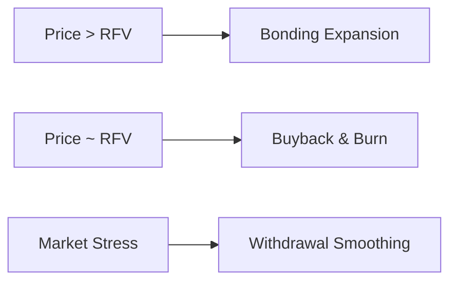

# Stability Mechanisms

Maxum enforces stability through deterministic, non-discretionary mechanisms.

When market price exceeds treasury-backed value, bonding introduces controlled expansion. Discounted positions incentivize capital inflow, while vesting ensures that supply is distributed over time rather than injected immediately.

When market price approaches RFV, treasury reserves are deployed to repurchase MAX from the open market. Repurchased tokens are burned, reducing circulating supply and reinforcing the price floor.

These mechanisms operate symmetrically. Expansion absorbs upward volatility. Treasury deployment absorbs downward pressure.

The system also enforces conditional withdrawal constraints during extreme market stress. When predefined thresholds are triggered, staking withdrawals are released over time rather than instantly. This prevents cascading liquidation dynamics and provides the system with time to stabilize.

Stability is embedded in the system’s logic.

# Stability Mechanisms

Maxum enforces stability through deterministic, non-discretionary mechanisms.

When market price exceeds treasury-backed value, bonding introduces controlled expansion. Discounted positions incentivize capital inflow, while vesting ensures that supply is distributed over time rather than injected immediately.

When market price approaches RFV, treasury reserves are deployed to repurchase MAX from the open market. Repurchased tokens are burned, reducing circulating supply and reinforcing the price floor.

These mechanisms operate symmetrically. Expansion absorbs upward volatility. Treasury deployment absorbs downward pressure.

The system also enforces conditional withdrawal constraints during extreme market stress. When predefined thresholds are triggered, staking withdrawals are released over time rather than instantly. This prevents cascading liquidation dynamics and provides the system with time to stabilize.

Stability is embedded in the system’s logic.
