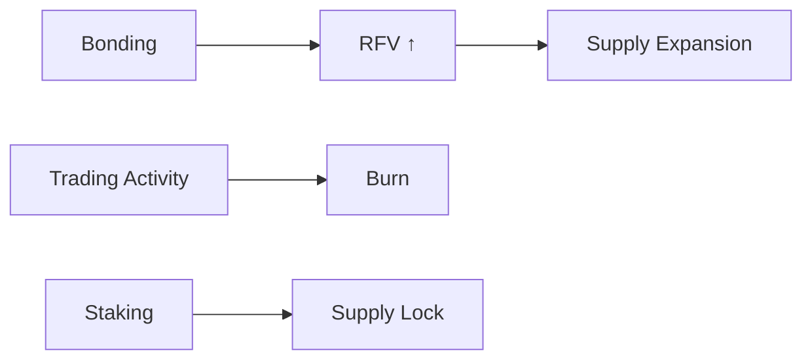

# Supply Control

MAX operates under a balance sheet–constrained elastic supply model.

There is no fixed cap and no arbitrary issuance schedule. Supply is governed by alignment with the system’s balance sheet.

Circulating supply is bounded by RFV. Expansion occurs only when the treasury grows. This growth is driven by bonding and fee accumulation.

New supply is introduced through structured mechanisms, including staking outputs and system allocations, ensuring alignment with system expansion.

Contraction occurs continuously through transaction-level burns. Each transaction removes supply from circulation, introducing a deflationary mechanism proportional to activity.

Staking reinforces this structure by removing tokens from active circulation over defined time horizons. This reduces available supply and stabilizes the system during expansion phases.

Supply is dynamically regulated through capital intake, transaction activity, and participation.

# Supply Control

MAX operates under a balance sheet–constrained elastic supply model.

There is no fixed cap and no arbitrary issuance schedule. Supply is governed by alignment with the system’s balance sheet.

Circulating supply is bounded by RFV. Expansion occurs only when the treasury grows. This growth is driven by bonding and fee accumulation.

New supply is introduced through structured mechanisms, including staking outputs and system allocations, ensuring alignment with system expansion.

Contraction occurs continuously through transaction-level burns. Each transaction removes supply from circulation, introducing a deflationary mechanism proportional to activity.

Staking reinforces this structure by removing tokens from active circulation over defined time horizons. This reduces available supply and stabilizes the system during expansion phases.

Supply is dynamically regulated through capital intake, transaction activity, and participation.
