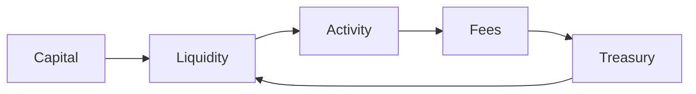

# System Overview

Maxum operates as a closed-loop capital system in which value is continuously captured, retained, and redeployed.

``` 
Capital → Liquidity → Activity → Fees → Treasury → Liquidity
```

Capital enters the system through bonding and market participation. This capital is not passively held. It is deployed into liquidity, forming the foundation for trading environments. Liquidity enables transactions, and transactions generate fees.

Each transaction contributes to the system through the fee mechanism, redistributing value across supply reduction, liquidity reinforcement, and treasury accumulation. Treasury growth increases the system’s Risk-Free Value, expanding the system’s capacity to support both supply and liquidity.

The system does not operate in stages—it operates as a loop. Each component reinforces the next.

This structure is enforced at the contract level. Growth is a function of activity. Activity directly expands the balance sheet.

Unlike systems that rely on external incentives or temporary liquidity provisioning, Maxum internalizes liquidity and captures value from usage. It does not depend on emissions. It does not depend on external capital cycles. It compounds its own activity.


# System Overview

> **System Constraint**  
> Circulating supply is bounded by RFV and expands only with balance sheet growth.


Maxum operates as a closed-loop capital system in which value is continuously captured, retained, and redeployed.

``` 
Capital → Liquidity → Activity → Fees → Treasury → Liquidity
```

Capital enters the system through bonding and market participation. This capital is not passively held. It is deployed into liquidity, forming the foundation for trading environments. Liquidity enables transactions, and transactions generate fees.

Each transaction contributes to the system through the fee mechanism, redistributing value across supply reduction, liquidity reinforcement, and treasury accumulation. Treasury growth increases the system’s Risk-Free Value, expanding the system’s capacity to support both supply and liquidity.

The system does not operate in stages—it operates as a loop. Each component reinforces the next.

This structure is enforced at the contract level. Growth is a function of activity. Activity directly expands the balance sheet.

Unlike systems that rely on external incentives or temporary liquidity provisioning, Maxum internalizes liquidity and captures value from usage. It does not depend on emissions. It does not depend on external capital cycles. It compounds its own activity.
